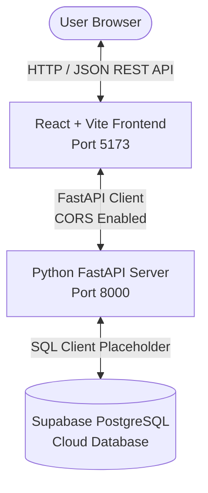

# FinGuard System Architecture 🏛️

This document explains how FinGuard is structured across all software layers.

---

## 1. High-Level Architecture Diagram

---

## 2. Layer-by-Layer Explanation

### A. Frontend Layer (`frontend/`) — Dhanvi's Domain
- **Framework**: React + Vite using JavaScript.
- **Routing**: `react-router-dom` delivers client-side page transitions without full browser reloads.
- **State & Service**: Centralized API service (`src/services/api.js`) to make fetch calls to FastAPI.
- **Design System**: Modern, accessible CSS styling in `src/styles/main.css`.

### B. API Gateway & Router Layer (`backend/app/api/`) — Neev's Domain
- **FastAPI Router**: Modular endpoints organized under `/api/v1/`.
- **CORS Middleware**: Allows localhost:5173 to safely make asynchronous requests.
- **Schemas**: Pydantic models in `app/schemas/` ensure incoming and outgoing data types are valid.

### C. Business Logic & Services (`backend/app/services/`) — Neev & Sanvi's Domain
- Placeholders for calculation algorithms, recurring detection rules, and fraud awareness matching.
- Kept isolated from route handlers for clean unit testing.

### D. Database Layer (`database/` & `backend/app/db/`) — Sanvi's Domain
- **Database Engine**: PostgreSQL hosted on Supabase.
- **Security**: Database secrets are injected via `.env` and never exposed to the frontend.
- **Schemas**: SQL migration scripts stored in `database/schema.sql`.

---

## 3. Data Flow Example: Adding a Transaction
1. **Dhanvi's UI** captures user input (e.g. ₹200 for Books).
2. **`api.js`** sends a `POST /api/v1/transactions` request with JSON body.
3. **Neev's Route** receives the request and **Pydantic** verifies the types.
4. **Sanvi's DB Service** persists the record into the Supabase `transactions` table.
5. **Backend** returns `{ "status": "success", "data": {...} }`.
6. **Frontend** updates the UI table instantly.
